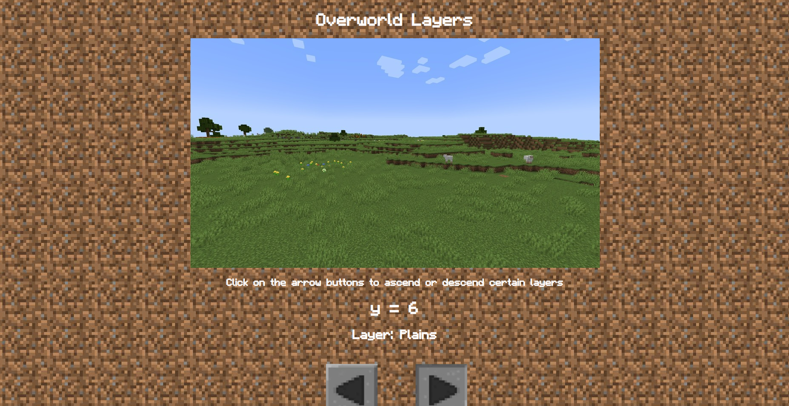

# MC-Code-Gallery

Now that you learned how to create variables and if/else statements, it's time to apply it to creating your website.  But not just any website, an ICSpark project about Minecraft.  There are many possibilities of implementing Minecraft coding references to a website, but for the sake of this project, we'll just stick with an Entity Gallery and Overworld Layers. 

  

I'd like to give you a **warning** that this project is pretty lengthy and requires the repetition of creating variables.  Hence, why this project is divided into 3 parts. 

## Objectives

Use **JavaScript** to display text and manipulate elements on webpages.  Also, use HTML and CSS to display annd format images on webpages.
  1. Create a gallery of Entity data types
  2. Create a gallery of Game Rule data types
  3. Create another webpage that lets the user click on the arrow buttons to change the vertical position along with the Minecraft environment

## Prerequisites

To complete this project, students should have the following:
  + Basic understanding of HTML structures and attributes.
    + img and div tags 
  + Basic understanding of CSS properties.
  + Basic understanding of JavaScript and DOM.
    + int, float, string, and bool variables
    + if/else statements 

## Concepts

| HTML | Description |
| ------------- | ------------- |
| br | The line break element |
| img | Element that embeds an image on a webpage |
| div | Division tag that's a container element |
| pre | The preformatted text element |

The `<br>` tag is pretty handy when you want to format your webpage by creating vertical line spacing between text and images.  This would make your webpage look nicer instead of having every element compacted so close to each other.  
The `<pre>` tag is similar to the `<p>` tag, however, it preserves the whitespaces (" "), line breaks ("\n"), and other escape sequence characters from JavaScript code, unlike the paragraph element.  It's what makes outputting JavaScript code onto a webpage more effective.

More information about `<pre>` can be found at [W3Schools](https://www.w3schools.com/tags/tag_pre.asp) and [Mozilla](https://developer.mozilla.org/en-US/docs/Web/HTML/Element/pre). 

| CSS  | Description |
| ------------- | ------------- |
| @import url | imports other stylesheets, including custom fonts, into an existing CSS file |

We'll use `@import url("#");` to import a custom font into this project.  The "#" represents a website link to a custom font.  Like any programming language, `@import url("#");` must be used at the very top of your CSS file.

Side note: URL stands for uniform resource locator

| JavaScript  | Description |
| ------------- | ------------- |
| \t | escape sequence for horizontal tab |
| string concactenation (+) | joins 2 or more strings together |
| string concactenation (+=) | joins 1 or more strings together into an existing string variable |

When you find coding several whitespaces to be tiring, use `\t` as it's equivalent to about 8 whitespaces.  It is somewhat similar to the horizontal version of a line break.

### String Concactenation

String Concactenation is the process of adding two strings together to form one string.  In other words, it's like joining two words together.  For example, appending "Poly" and "gon" gives us "Polygon".  Let's see how string concactenation works in JavaScript.

```js
// the whitespace helps us read the two words easily
console.log("Removed" + " " + "Herobrine");
```
Result: Remove Herobrine
```js
// string concactenation with variables
var string1 = "Glitch Art";
var string2 = " is so cool!";

console.log(string1 + string2);
// Result: Glitch Art is so cool!
```
Notice how there's a whitespace right before "is" in the variable string2.  This is a shorter way of doing ```console.log("Glitch Art" + " " + "is so cool!")```.  It may look aesthetically weird, but it makes your code more compact by typing less code.  In other words, it's the opposite of doing more work than you should.  Without the whitespace, the result would be "Glitch Artis so cool!", which makes the reader more confused whether "Artis" is another word or "Artis" is supposed to be "Art is".
```js
var game = "Minecraft is about ";
var genre1 = "building";
var genre2 = "exploring";
var genre3 = "adventuring";
var genre4 = "mini games.";

// string concactenation by appending multiple string variables into one string variable
game += genre1 + ", " + genre2 + ", " + genre3 + ", and " + genre4;

console.log(game);
// Result: Minecraft is about building, exploring, adventuring, and mini games.
```
Notice how '+=' is used to join multiple strings together.  This is to add more information to the same string variable.  It'll come in handy when you don't want to type a long-baked horizontal line of code.  If you want to add more strings to a string variable, you can press enter and type the same thing again but with different string variables. 

## Your Challenge

### Part I

WIP

### Part II

WIP

### Part III

WIP

### Part IV

WIP

## Stretch Goals

### Change Image Size within HTML files

You learned how to resize images in the CSS file.
```css
.changeImageSize {
    width: 255px;
    height: 255px;
}

.changeImageSize2 {
    width: 320px;
    height: 320px;
}

.changeImageSize3 {
    width: 600px;
    height: 300px;
}
```
You can also resize images in HTML, and it's "easier" as it requires less lines of code.  Just type in the width and height inside of the image tag.  Here's an example of resizing an image in HTML:
```html
<!-- image became twice as large -->

```

### Add hover animation for links

You learned how to color the text of the link, give it a background color, and change its font size.  You also learned how to position the link.
```css
a {
    color: rgb(0, 255, 0);
    background-color: gray;
    font-size: 21px;
    text-align: center;
    text-decoration: none;
}
```
Now try making the link's text color white and have it change to orange if the mouse cursor is hovering over it.

### Create an input box instead of arrow "buttons"

The advantage of having arrow "buttons" is having more user interaction.  The disadvantage is it can take a lot of time to go through a large range of numbers(unless if your variable can increment/decrement by a large amount).  A way around this disadvantage is by making the y_position range smaller.  But in Minecraft, going deep underground takes more than a few blocks.  So, an input box lets you type in a number and display the result in seconds.  You could create a ```<form>``` tag but that would redirect to a webpage.  Instead of going through that hassle, you can create an input tag and a button tag.  
Although it's easy to implement an input box, you'll deal with more test cases.  Like most programming languages, input returns a string value.  Because of this, you must check if the input contains letters or other non-numeric characters.  If it is, then display an error message.  Otherwise, convert the input value into a number.  In order to compare your input value with numbers, it must be converted to a number.          

### Create another webpage of Minecraft coding references

Apply conditional operators (<, >, <=, >=, ==, !=) to ranking minecraft armor.  Apply the &&(and) and the ||(or) logical operators to when the player is able to go to sleep.  Those conditions are when it's night time or there's a thunderstorm and when there's no hostile mobs nearby.  Apply the !(not; negation) logical operator to when the mob is not hostile, the iron golem and snow golem won't attack that mob.  No if/else statements are invovled, however, try to output text to the webpage via a JavaScript file.    
