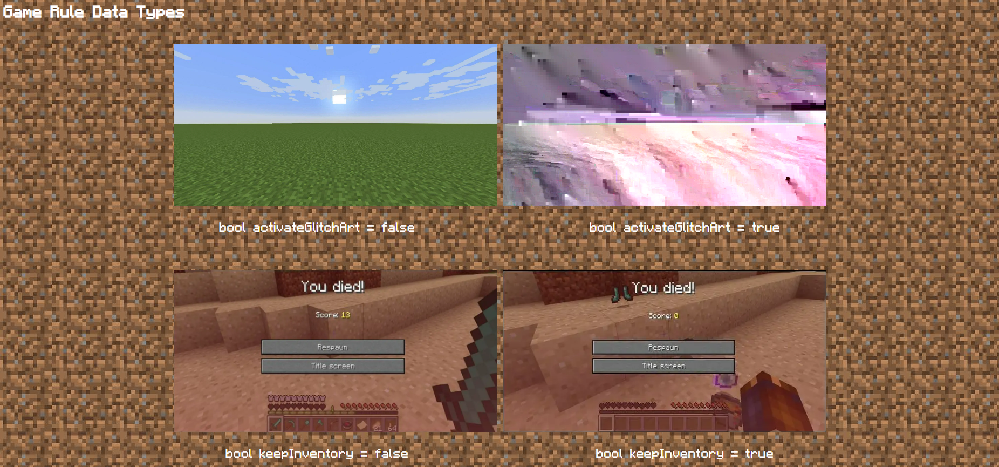

# MC-Code-Gallery

Now that you learned how to create variables and if/else statements, it's time to apply it to creating your website.  But not just any website, an ICSpark project about Minecraft.  There are many possibilities of implementing Minecraft coding references to a website, but for the sake of this project, we'll just stick with an Entity Gallery and Overworld Layers. 

  

I'd like to give you a **warning** that this project is pretty lengthy and requires the repetition of creating variables.  Hence, why this project is divided into 3 parts.  Not to mention, images will also guide you for this instructions file.  

## Objectives

Use **JavaScript** to display text and manipulate elements on webpages.  Also, use HTML and CSS to display annd format images on webpages.
  1. Create a gallery of Entity data types
  2. Create a gallery of Game Rule data types
  3. Create another webpage that lets the user click on the arrow buttons to change the vertical position along with the Minecraft environment

## Prerequisites

To complete this project, students should have the following:
  + Basic understanding of HTML structures and attributes.
    + img and div tags 
  + Basic understanding of CSS properties.
  + Basic understanding of JavaScript and DOM.
    + int, float, string, and bool variables
    + if/else statements 

## Concepts

| HTML | Description |
| ------------- | ------------- |
| br | The line break element |
| img | Element that embeds an image on a webpage |
| div | Division tag that's a container element |
| pre | The preformatted text element |

The ` ` tag is pretty handy when you want to format your webpage by creating vertical line spacing between text and images.  This would make your webpage look nicer instead of having every element compacted so close to each other.  
The `<pre>` tag is similar to the `
` tag, however, it preserves the whitespaces (" "), line breaks ("\n"), and other escape sequence characters from JavaScript code, unlike the paragraph element.  It's what makes outputting JavaScript code onto a webpage more effective.

More information about `<pre>` can be found at [W3Schools](https://www.w3schools.com/tags/tag_pre.asp) and [Mozilla](https://developer.mozilla.org/en-US/docs/Web/HTML/Element/pre). 

| CSS  | Description |
| ------------- | ------------- |
| @import url | imports other stylesheets, including custom fonts, into an existing CSS file |

We'll use `@import url("#");` to import a custom font into this project.  The "#" represents a website link of a custom font.  Like any programming language, `@import url("#");` must be used at the very top of your CSS file.

Side note: URL stands for uniform resource locator

| JavaScript  | Description |
| ------------- | ------------- |
| \t | escape sequence for horizontal tab |
| string concactenation (+) | joins 2 or more strings together |
| string concactenation (+=) | joins 1 or more strings together into an existing string variable |

When you find coding several whitespaces to be tiring, use `\t` as it's equivalent to about 8 whitespaces.  It is somewhat similar to the horizontal version of a line break.

### String Concactenation

WIP
